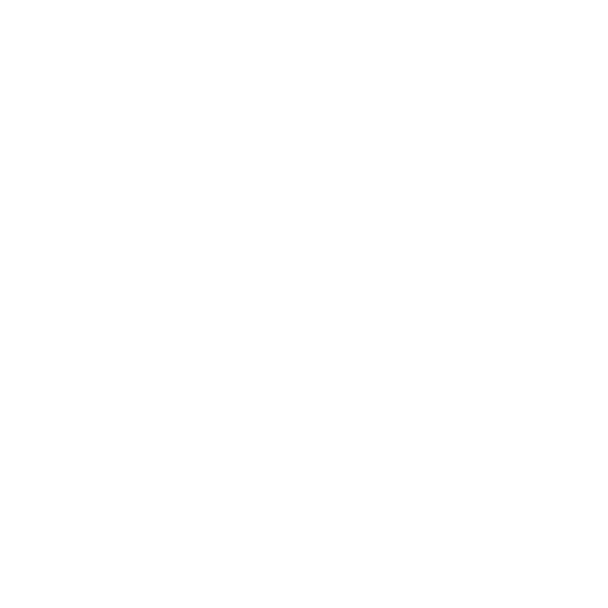

[//]: # "Personal Logo Section"

    <picture>
        <source media="(prefers-color-scheme: dark)" srcset="./assets/branding/logo_ac_white.svg">
        <source media="(prefers-color-scheme: light)" srcset="./assets/branding/logo_ac_black.svg">
        
    </picture>

# 🌌 Welcome to my U-verse

[//]: # "Current & Aimed Job"

    <h4>My Chosen Aspiration</h4>
    

        <em>
            TypeScript Full-Stack Developer
             Product-minded Individual Contributor
              <strong>React · Next.js · Node.js · Figma</strong>
        </em>
    

     
    

[//]: # "My ways of working"

## 🧠 My Documented Philosophy

🧩 **Compartmentalizing Complexity** — _Set clear boundaries for growing systems to remain understandable, adaptable & maintainable._

📚 **Documentation as Blueprint** — _Give future humans & AI collaborators a map through a project's architecture, conventions & reasoning._

🧪 **Tooling & Testing as Foundation** — _Treat tooling & testing as structural parts of the product, not final details postponed to the end._

🤝 **AI as Engineering Collaborator** — _Brainstorm with it, challenge assumptions & prototype ideas quickly while keeping verification, architectural judgment & final decisions human-led._

[🌪️ Back to the top](#-welcome-to-my-u-verse--)

[//]: # "Current Work & Learning Subjects"

## 💭 On my mind~

### 🔭 Currently Building

🌌 **U-verse Ecosystem**

_A **personal portfolio universe** bringing together full-stack engineering, design direction, reusable systems & the tools supporting them._

[Explore the project →]()

🧰 **Atelier**

_A **project factory** for **starting & structuring new projects** with reusable architecture, conventions & tooling._

[Explore the project →]()

🌺 **Songe Péi Ecosystem**

_An evolving **ecosystem of automation tools & digital workflows** for **short-term rental operations**._

[Explore the project →]()

### 🌱 Currently Learning

🤖 **AI Engineering** — _Agents, RAG, MCP & AI-assisted workflows through skills & plugins._

🧭 **Product Engineering** — _Product discovery, architecture, developer experience & iterative delivery._

🎨 **Programmatic Illustration & Animation** — _2D vector graphics, 3D scenes, motion & lightweight interactive visuals._

[🌪️ Back to the top](#-welcome-to-my-u-verse--)
