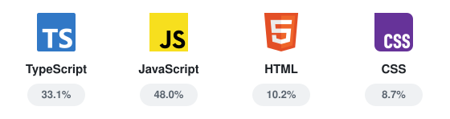
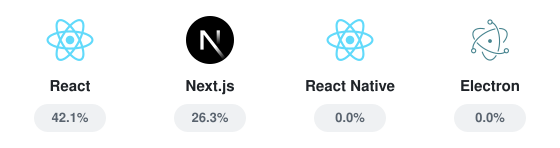
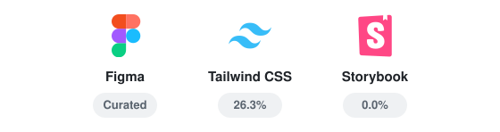
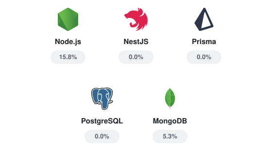
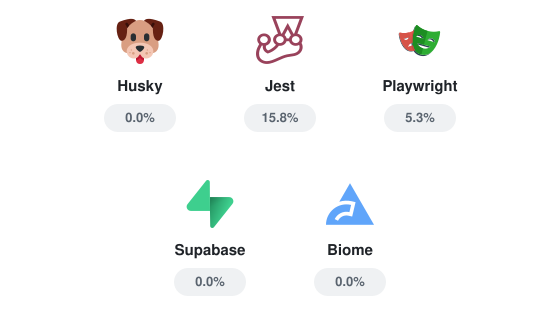
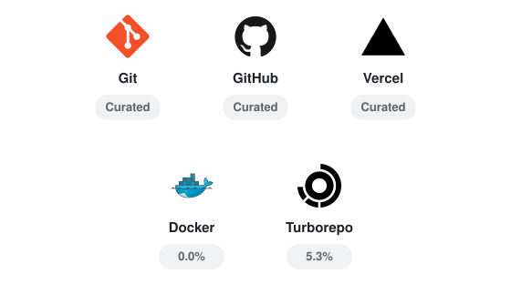

[//]: # "Personal Logo Section"

# 🌌 Welcome to my U-verse

[//]: # "Current Job Title & Objective"

    <h4>My Chosen Aspiration</h4>
    

        <em>
            TypeScript Full-Stack Developer
             Product-minded Individual Contributor
              <strong>React · Next.js · Node.js · Figma</strong>
        </em>
    

     
    

[//]: # "My Ways of Working"

## 🧠 My Documented Philosophy

🧩 **Compartmentalizing Complexity** — _Set clear boundaries for growing systems to remain understandable, adaptable & maintainable._

📚 **Documentation as Blueprint** — _Give future humans & AI collaborators a map through a project's architecture, conventions & reasoning._

🧪 **Tooling & Testing as Foundation** — _Treat tooling & testing as structural parts of the product, not final details postponed to the end._

🤝 **AI as Engineering Collaborator** — _Brainstorm with it, challenge assumptions & prototype ideas quickly while keeping verification, architectural judgment & final decisions human-led._

[🌪️ Back to the top](#-welcome-to-my-u-verse)

[//]: # "My Little Laboratory"

## 💭 On my mind~

### 🔭 Currently Building

🌌 **U-verse Ecosystem**

_A **personal portfolio universe** bringing together full-stack engineering, design direction, reusable systems & the tools supporting them._

[Explore the project →](https://www.u-verse.world/)

🧰 **Atelier**

_A **project factory** for **starting & structuring new projects** with reusable architecture, conventions & tooling._

[Explore the project →](https://atelier-one-livid.vercel.app/)

🌺 **Songe Péi Ecosystem**

_An evolving **ecosystem of automation tools & digital workflows** for managing [Songe Péi 🌺](https://www.booking.com/hotel/re/songe-pei-t2-est-reunion-piscine-amp-parking.html?lang=en-us), a **short-term rental apartment** on Réunion Island._

[Explore the project →](https://songe-pei-ecosystem.vercel.app/)

[🌪️ Back to the top](#-welcome-to-my-u-verse)

[//]: # "My Daily Learning Doses"

### 🌱 Currently Learning

🤖 **AI Engineering** — _Agents, RAG, MCP & AI-assisted workflows through skills & plugins._

🧭 **Product Engineering** — _Product discovery, architecture, developer experience & iterative delivery._

🎨 **Programmatic Illustration & Animation** — _2D vector graphics, 3D scenes, motion & lightweight interactive visuals._

[🌪️ Back to the top](#-welcome-to-my-u-verse)

[//]: # "The Way I Am"

## ✨ My Unexpected Talents

🕵🏾‍♀️ **Detective** _(a.k.a Research & Discovery)_ — _**Investigate customer needs & market context** to uncover the details that shape better product decisions._

👩🏾‍💼 **Coordinator** _(a.k.a Product Synthesis & Planning)_ — _**Connect ideas, requirements & constraints** to turn scattered inputs into a coherent product direction._

👩🏾‍🏫 **Advisor** _(a.k.a Guidance & Knowledge Sharing)_ — _**Share tailored guidance** to help people strengthen their skills, decisions & products._

👩🏾‍🎨 **Designer** _(a.k.a UI/UX & Visual Direction)_ — _**Craft engaging interfaces** that translate product ideas into clear & expressive user experiences._

[🌪️ Back to the top](#-welcome-to-my-u-verse)

[//]: # "HRs' Hunting Field"

## ⚔️ My Honed Skills

### 👨‍💻 Applications & Systems

🌐 Web Apps · 📱 Mobile Apps · 🖥️ Desktop Apps · ⚙️ Servers & APIs · 🤖 AI Automation

### 📐 Responsive Interfaces

🖥️ Desktop · 💻 Laptop · 📟 Tablet · 📱 Mobile

### 🧬 Languages & Web Foundations

> 🖋️ **_N.B.:_**
>
> _The percentages above are calculated from [GitHub Linguist](https://github.com/github-linguist/linguist) data across selected analyzed repositories._

### 🧩 Frontend

> 🖋️ **_N.B.:_**
>
> _The percentages above represent the share of my analyzed repositories in which each technology is detected._

### 🎨 UI Systems & Design

> 🖋️ **_N.B.:_**
>
> _The percentages above represent the share of my analyzed repositories in which each technology is detected._

### ⚙️ Backend & Data

> 🖋️ **_N.B.:_**
>
> _The percentages above represent the share of my analyzed repositories in which each technology is detected._

### 🧪 Testing & Tooling

> 🖋️ **_N.B.:_**
>
> _The percentages above represent the share of my analyzed repositories in which each technology is detected._

### 🏗️ Architecture & Delivery

> 🖋️ **_N.B.:_**
>
> _The percentages above represent the share of my analyzed repositories in which each technology is detected._

[🌪️ Back to the top](#-welcome-to-my-u-verse)

[//]: # "Mascot - Private Cocoon"

<h3 align="center"><b>🤫 <em>A wild Lixi is dreaming about our next projects~</em> 🙊</b></h3>

    
    

